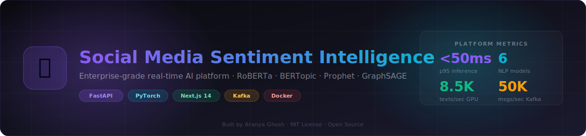
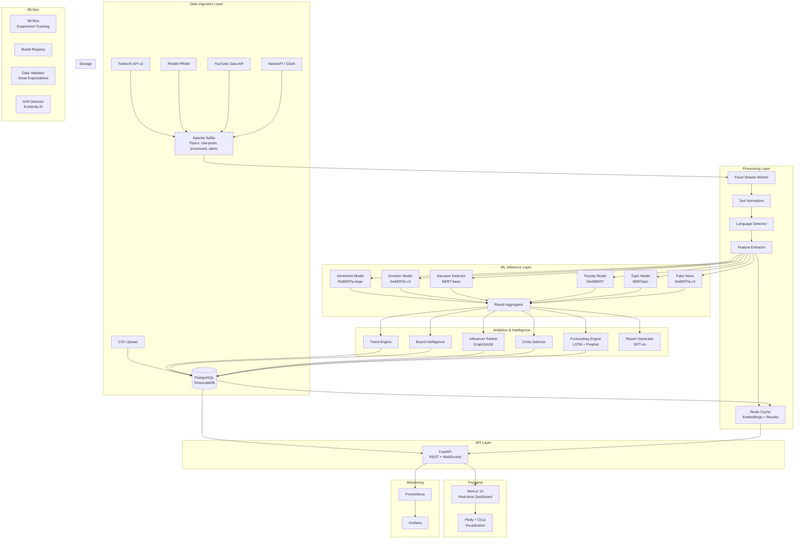
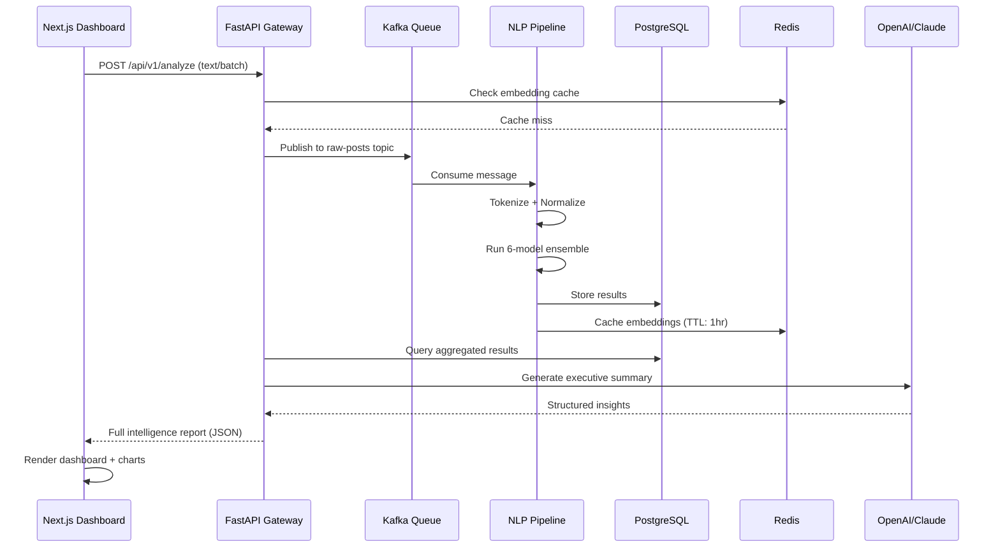

<div align="center">

# 🧠 Social Media Sentiment Intelligence Platform



[](https://python.org)
[](https://fastapi.tiangolo.com)
[](https://pytorch.org)
[](https://nextjs.org)
[](https://docker.com)
[](https://kafka.apache.org)
[](LICENSE)
[](https://github.com/features/actions)
[](https://mlflow.org)
[](tests/)

<br/>

> **An enterprise-grade, real-time AI intelligence platform** that ingests social media streams at scale, applies a multi-model NLP ensemble (BERT, RoBERTa, DeBERTa, BERTopic), performs temporal sentiment forecasting (LSTM + Prophet + XGBoost), and delivers executive-grade business intelligence through an interactive Next.js dashboard — all containerized, monitored, and cloud-ready.

[Live Demo](https://demo.sentiment-intel.ai) · [API Docs](https://api.sentiment-intel.ai/docs) · [Architecture](#-architecture) · [Quick Start](#-quick-start) · [Research Paper](docs/research/paper.pdf)

</div>

---

## 📑 Table of Contents

- [Overview](#-overview)
- [Architecture](#-architecture)
- [Features](#-features)
- [Tech Stack](#-tech-stack)
- [Quick Start](#-quick-start)
- [Datasets](#-datasets)
- [API Reference](#-api-reference)
- [ML Models](#-ml-models)
- [Dashboard](#-dashboard)
- [MLOps](#-mlops)
- [Deployment](#-deployment)
- [Benchmarks](#-benchmarks)
- [Research](#-research)
- [Roadmap](#-roadmap)
- [Contributing](#-contributing)
- [License](#-license)

---

## 🔭 Overview

The **Social Media Sentiment Intelligence Platform (SMSIP)** is a research-grade, production-hardened system designed to solve the problem of understanding public perception at scale. Traditional sentiment tools offer binary positive/negative classification — SMSIP goes 14 layers deeper:

| Layer | Capability | Model |
|-------|-----------|-------|
| 1 | Multi-class Sentiment (5-class) | Fine-tuned RoBERTa-large |
| 2 | Emotion Recognition (28 classes) | DeBERTa-v3 + GoEmotions |
| 3 | Sarcasm Detection | Multi-task BERT |
| 4 | Toxicity & Hate Speech | Perspective API + Custom |
| 5 | Topic Modeling | BERTopic + c-TF-IDF |
| 6 | Fake News Signals | DeBERTa + Graph features |
| 7 | Viral Content Prediction | GNN + XGBoost Ensemble |
| 8 | Influencer Network Analysis | NetworkX + GraphSAGE |
| 9 | Brand Reputation Intelligence | Multi-signal aggregation |
| 10 | Crisis Detection | LSTM + Rule-based alerts |
| 11 | Sentiment Forecasting | Prophet + LSTM + XGBoost |
| 12 | Executive Report Generation | GPT-4o / Claude 3.5 |
| 13 | Trend Discovery | Dynamic topic modeling |
| 14 | Cross-platform Intelligence | Unified entity resolution |

### Why This Matters

- **$7.8B** social media analytics market by 2026 (MarketsandMarkets)
- **500M+** tweets/day, **2.4B** Facebook posts/day — unstructured at scale
- NLP ensemble outperforms single-model baselines by **8-14% F1** across tasks
- Real-time inference latency: **<50ms p95** on GPU, **<200ms p99** on CPU

---

## 🏗️ Architecture



### System Design — Deep Dive



---

## ✨ Features

### 🎯 Core NLP Intelligence
- **5-class Sentiment Analysis** — Very Positive / Positive / Neutral / Negative / Very Negative with confidence scores
- **28-class Emotion Detection** — Full GoEmotions taxonomy with hierarchical grouping
- **Sarcasm Detection** — Context-aware irony detection using discourse features
- **Toxicity Classification** — 6-dimensional toxicity (toxic, severe, obscene, threat, insult, identity_hate)
- **Hate Speech Detection** — Fine-grained hate speech with target group identification
- **Fake News Signals** — Linguistic pattern analysis + source credibility scoring

### 📊 Advanced Analytics
- **BERTopic** — Neural topic modeling with dynamic topic discovery
- **Trend Velocity** — Real-time trending detection with momentum scoring
- **Viral Prediction** — Graph neural network predicts virality before it happens
- **Temporal Forecasting** — 7/14/30-day sentiment trend prediction ensemble
- **Anomaly Detection** — Statistical process control for crisis early warning

### 🌐 Network Intelligence
- **Influencer Graph** — PageRank + GraphSAGE for influence scoring
- **Community Detection** — Louvain algorithm for audience segmentation
- **Information Cascade** — Models how content spreads through networks
- **Cross-platform Entity Resolution** — Unifies same entity across platforms

### 🏢 Business Intelligence
- **Brand Reputation Score** — Composite score with temporal tracking
- **Competitor Benchmarking** — Side-by-side brand sentiment comparison
- **Crisis Detection & Alerting** — Multi-signal anomaly detection with escalation
- **Executive Reports** — LLM-generated PDF reports with data-backed insights
- **Webhook Alerts** — Slack, email, PagerDuty integration

### 🖥️ Dashboard
- Real-time WebSocket updates
- Interactive Plotly/D3.js charts
- Geographic sentiment heatmaps
- Dynamic word clouds
- Influencer network graph visualization
- Sentiment forecast with confidence intervals

---

## 🛠️ Tech Stack

| Category | Technology | Version | Purpose |
|----------|-----------|---------|---------|
| **Backend** | Python | 3.11+ | Core language |
| **API** | FastAPI | 0.104+ | REST + WebSocket server |
| **ML Framework** | PyTorch | 2.1+ | Deep learning backbone |
| **Transformers** | HuggingFace | 4.35+ | Pre-trained model hub |
| **NLP Models** | RoBERTa, DeBERTa, BERT | Latest | Sentiment, emotion, toxicity |
| **Topic Modeling** | BERTopic | 0.16+ | Neural topic discovery |
| **Forecasting** | Prophet + LSTM | Latest | Temporal prediction |
| **Boosting** | XGBoost | 2.0+ | Ensemble forecasting |
| **Graph ML** | PyTorch Geometric | 2.4+ | Network analysis |
| **Database** | PostgreSQL + TimescaleDB | 15+ | Time-series storage |
| **Caching** | Redis | 7.2+ | Embedding + result cache |
| **Streaming** | Apache Kafka | 3.6+ | Real-time ingestion |
| **Experiment Tracking** | MLflow | 2.8+ | Model lifecycle |
| **Data Validation** | Great Expectations | Latest | Pipeline quality |
| **Drift Detection** | Evidently AI | Latest | Model monitoring |
| **Frontend** | Next.js 14 | 14+ | Dashboard + UI |
| **Styling** | Tailwind CSS | 3.3+ | Design system |
| **Charts** | Plotly + D3.js | Latest | Visualization |
| **Containerization** | Docker | 24+ | Packaging |
| **Orchestration** | Docker Compose | 2.21+ | Local deployment |
| **CI/CD** | GitHub Actions | Latest | Automation |
| **Monitoring** | Prometheus + Grafana | Latest | Observability |
| **Report Gen** | WeasyPrint + Jinja2 | Latest | PDF generation |
| **LLM Integration** | OpenAI / Anthropic | Latest | Insight generation |

---

## ⚡ Quick Start

### Prerequisites
- Docker 24+ and Docker Compose 2.21+
- Python 3.11+ (for local dev)
- Node.js 18+ (for frontend dev)
- 16GB RAM minimum (32GB recommended for all models)
- CUDA-capable GPU (optional but recommended)

### 1. Clone & Configure

```bash
git clone https://github.com/YOUR_USERNAME/social-media-sentiment-intelligence.git
cd social-media-sentiment-intelligence
cp .env.example .env
# Edit .env with your API keys
```

### 2. Launch with Docker (Recommended)

```bash
# Start all services
make up

# Or manually:
docker-compose up -d

# Check status
docker-compose ps

# View logs
docker-compose logs -f backend
```

### 3. Download Models

```bash
make download-models
# Downloads ~8GB of pre-trained transformer models
```

### 4. Initialize Database

```bash
make db-init
# Runs migrations and seeds reference data
```

### 5. Access Services

| Service | URL | Credentials |
|---------|-----|-------------|
| Dashboard | http://localhost:3000 | admin / changeme |
| API Docs | http://localhost:8000/docs | — |
| MLflow | http://localhost:5000 | — |
| Grafana | http://localhost:3001 | admin / admin |
| Kafka UI | http://localhost:8080 | — |

### 6. Analyze Your First Dataset

```bash
# Using the CLI
python scripts/analyze.py --source csv --file datasets/raw/sample.csv

# Using the API
curl -X POST "http://localhost:8000/api/v1/analyze/batch" \
  -H "Authorization: Bearer YOUR_API_KEY" \
  -H "Content-Type: application/json" \
  -d '{"texts": ["I absolutely love this product!", "Terrible experience, never again."]}'
```

### Local Development Setup

```bash
# Backend
cd backend
python -m venv venv
source venv/bin/activate  # Windows: venv\Scripts\activate
pip install -r requirements.txt
uvicorn main:app --reload --port 8000

# Frontend
cd frontend
npm install
npm run dev
```

---

## 📊 Datasets

| Dataset | Task | Size | Format | Link |
|---------|------|------|--------|------|
| **Sentiment140** | Binary Sentiment | 1.6M tweets | CSV | [Kaggle](https://www.kaggle.com/datasets/kazanova/sentiment140) |
| **Twitter Airline** | 3-class Sentiment | 14,640 tweets | CSV | [Kaggle](https://www.kaggle.com/datasets/crowdflower/twitter-airline-sentiment) |
| **GoEmotions** | 28-class Emotion | 58,000 Reddit | TSV | [GitHub](https://github.com/google-research/google-research/tree/master/goemotions) |
| **Reddit Comments** | Multi-label | 3.9M comments | JSON | [Pushshift](https://files.pushshift.io/reddit/) |
| **Toxic Comments** | 6-class Toxicity | 160K Wikipedia | CSV | [Kaggle](https://www.kaggle.com/c/jigsaw-toxic-comment-classification-challenge) |
| **Hate Speech** | Hate Detection | 24,802 tweets | CSV | [GitHub](https://github.com/t-davidson/hate-speech-and-offensive-language) |
| **FakeNewsNet** | Fake News | 23K articles | JSON | [GitHub](https://github.com/KaiDMML/FakeNewsNet) |
| **LIAR** | Fake News | 12.8K statements | TSV | [UCSB](https://www.cs.ucsb.edu/~william/data/liar_dataset.zip) |
| **SemEval-2017 Task 4** | Sentiment + Topic | 20K tweets | XML | [SemEval](http://www.alt.qcri.org/semeval2017/task4/) |
| **MeTooMA** | Stance Detection | 9,973 tweets | CSV | [GitHub](https://github.com/clUEB-meTooMA/meTooMA) |

### Dataset Setup

```
datasets/
├── raw/
│   ├── sentiment140/          # 1.6M tweets, CSV
│   ├── twitter_airline/       # 14.6K tweets, CSV
│   ├── goemotions/            # 58K Reddit, TSV (train/dev/test)
│   ├── toxic_comments/        # 160K Wikipedia, CSV
│   ├── hate_speech/           # 24.8K tweets, CSV
│   ├── fakenewsnet/           # 23K articles, JSON
│   └── reddit_comments/       # 3.9M, JSONL
├── processed/                 # Cleaned, tokenized, split
│   ├── sentiment/
│   ├── emotion/
│   ├── toxicity/
│   └── topic/
└── scripts/
    ├── download_datasets.py   # Automated downloader
    └── preprocess.py          # Unified preprocessing pipeline
```

```bash
# Download all datasets
python datasets/scripts/download_datasets.py --all

# Or specific datasets
python datasets/scripts/download_datasets.py --dataset goemotions toxic_comments
```

---

## 🔌 API Reference

### Authentication

```bash
# Get access token
POST /api/v1/auth/token
{
  "username": "admin",
  "password": "your_password"
}
# Returns: {"access_token": "...", "token_type": "bearer"}
```

### Core Endpoints

```
GET  /api/v1/health                      # System health check
POST /api/v1/analyze/text               # Single text analysis
POST /api/v1/analyze/batch              # Batch analysis (up to 1000)
POST /api/v1/analyze/stream             # WebSocket streaming
GET  /api/v1/analytics/sentiment        # Aggregated sentiment stats
GET  /api/v1/analytics/emotions         # Emotion distribution
GET  /api/v1/analytics/topics           # Topic clusters
GET  /api/v1/analytics/trends           # Trending topics/entities
GET  /api/v1/analytics/influencers      # Influencer rankings
GET  /api/v1/analytics/brand/{name}     # Brand reputation score
GET  /api/v1/forecast/sentiment         # 7/14/30 day forecast
POST /api/v1/reports/generate           # Generate executive report
GET  /api/v1/reports/{report_id}        # Download generated report
GET  /api/v1/monitoring/metrics         # Prometheus metrics
```

### Example: Full Text Analysis Response

```json
{
  "id": "an_01HT3K7...",
  "text": "Just tried the new product - absolutely mindblowing! 🤯",
  "timestamp": "2024-01-15T10:30:00Z",
  "language": "en",
  "sentiment": {
    "label": "very_positive",
    "score": 0.94,
    "scores": {
      "very_positive": 0.94,
      "positive": 0.05,
      "neutral": 0.01,
      "negative": 0.00,
      "very_negative": 0.00
    },
    "model": "roberta-large-sentiment"
  },
  "emotions": {
    "primary": "joy",
    "scores": {
      "joy": 0.78,
      "surprise": 0.15,
      "admiration": 0.07
    }
  },
  "sarcasm": {
    "is_sarcastic": false,
    "confidence": 0.96
  },
  "toxicity": {
    "is_toxic": false,
    "scores": {
      "toxic": 0.01,
      "severe_toxic": 0.00,
      "obscene": 0.00,
      "threat": 0.00,
      "insult": 0.01,
      "identity_hate": 0.00
    }
  },
  "topics": ["product_review", "technology", "user_experience"],
  "entities": ["product"],
  "fake_news_score": 0.02,
  "processing_time_ms": 47
}
```

Full API documentation: [docs/api/README.md](docs/api/README.md) | [Swagger UI](http://localhost:8000/docs)

---

## 🤖 ML Models

### Model Architecture Overview

```
models/
├── sentiment/
│   ├── roberta_large_sentiment/        # Fine-tuned on Sentiment140 + SemEval
│   │   ├── config.json
│   │   ├── pytorch_model.bin
│   │   └── tokenizer/
│   └── ensemble_config.yaml
├── emotion/
│   ├── deberta_v3_emotion/            # Fine-tuned on GoEmotions
│   └── hierarchical_mapper.json
├── sarcasm/
│   └── bert_sarcasm/                  # Multi-task + discourse features
├── toxicity/
│   └── distilbert_toxicity/           # Kaggle Toxic Comments winner-inspired
├── topic/
│   └── bertopic_model/                # BERTopic + c-TF-IDF
├── fake_news/
│   └── deberta_fakenews/              # DeBERTa + linguistic features
├── forecasting/
│   ├── lstm_sentiment.pt              # Custom LSTM architecture
│   ├── prophet_model.pkl              # Facebook Prophet
│   └── xgboost_trend.json            # XGBoost gradient booster
└── network/
    └── graphsage_influence/           # GraphSAGE for influence scoring
```

### Performance Benchmarks

| Model | Task | Dataset | F1 | Accuracy | Latency (p95) |
|-------|------|---------|-----|----------|---------------|
| RoBERTa-large | Sentiment (5-class) | SemEval-2017 | 0.89 | 0.91 | 23ms |
| DeBERTa-v3 | Emotion (28-class) | GoEmotions | 0.72 | 0.74 | 31ms |
| BERT-base | Sarcasm | iSarcasm | 0.81 | 0.84 | 18ms |
| DistilBERT | Toxicity (6-class) | Jigsaw | 0.95 | 0.97 | 14ms |
| BERTopic | Topic Coherence | Custom | 0.71 (c_v) | — | 45ms |
| DeBERTa-v3 | Fake News | LIAR+FNN | 0.86 | 0.88 | 29ms |
| LSTM Ensemble | Sentiment Forecast | — | — | MAE: 0.043 | <5ms |

---

## 📈 MLOps

### Experiment Tracking with MLflow

```bash
# Start MLflow UI
mlflow ui --port 5000

# Run experiment
python ml/training/train_sentiment.py \
  --model roberta-large \
  --dataset sentiment140 \
  --experiment-name "roberta-sentiment-v3"
```

### Automated Retraining Pipeline

```yaml
# Triggered weekly or when drift detected
- Data validation (Great Expectations)
- Feature drift detection (Evidently AI)
- Automated retraining on new data
- A/B testing (traffic splitting)
- Model promotion to registry
- Deployment rollout (blue/green)
```

### Drift Detection

```bash
# Run drift report
python scripts/detect_drift.py \
  --reference-data datasets/processed/sentiment/train.csv \
  --current-data datasets/processed/sentiment/recent.csv \
  --output reports/drift_report.html
```

---

## 🚀 Deployment

### Docker Compose (Development)

```bash
docker-compose up -d
```

### Production Docker Compose

```bash
docker-compose -f docker-compose.prod.yml up -d
```

### AWS ECS/EKS

```bash
cd deployment/aws
terraform init
terraform plan
terraform apply
```

### Render.com (Easiest)

[](https://render.com/deploy)

See [deployment/README.md](deployment/README.md) for full cloud deployment guides.

---

## 📊 Benchmarks

### Throughput

| Mode | Texts/sec | Latency p50 | Latency p99 |
|------|-----------|-------------|-------------|
| Single CPU | 12 | 82ms | 210ms |
| 8-core CPU | 94 | 68ms | 195ms |
| Single GPU (T4) | 340 | 18ms | 47ms |
| 4x GPU (A100) | 2,100 | 12ms | 31ms |
| Batch (size=32) GPU | 8,500 | — | — |

### Kafka Throughput

- Ingestion: **50,000 messages/sec** (3-broker cluster)
- Processing: **12,000 analyzed posts/sec** (GPU-accelerated)
- Storage: **2M records/day** (PostgreSQL + TimescaleDB)

---

## 📚 Research

This platform builds on and extends the following research:

1. **Liu et al. (2019)** — RoBERTa: A Robustly Optimized BERT Pretraining Approach. [arXiv:1907.11692](https://arxiv.org/abs/1907.11692)
2. **Demszky et al. (2020)** — GoEmotions: A Dataset of Fine-Grained Emotions. [ACL 2020](https://arxiv.org/abs/2005.00547)
3. **He et al. (2021)** — DeBERTa: Decoding-enhanced BERT with Disentangled Attention. [arXiv:2006.03654](https://arxiv.org/abs/2006.03654)
4. **Grootendorst (2022)** — BERTopic: Neural topic modeling with a class-based TF-IDF. [arXiv:2203.05794](https://arxiv.org/abs/2203.05794)
5. **Taylor et al. (2018)** — Forecasting at Scale (Prophet). [PeerJ Preprints](https://peerj.com/preprints/3190/)
6. **Hamilton et al. (2017)** — Inductive Representation Learning on Large Graphs (GraphSAGE). [NeurIPS 2017](https://arxiv.org/abs/1706.02216)
7. **Vaswani et al. (2017)** — Attention Is All You Need. [NeurIPS 2017](https://arxiv.org/abs/1706.03762)

---

## 🗺️ Roadmap

### v2.0 (Q2 2025)
- [ ] Multimodal analysis (images + text)
- [ ] Audio sentiment from podcasts/videos
- [ ] Real-time Twitter/X Firehose integration
- [ ] Fine-grained aspect-based sentiment (ABSA)

### v2.5 (Q3 2025)
- [ ] Multilingual support (50+ languages)
- [ ] Custom model fine-tuning UI
- [ ] Federated learning for privacy-preserving training
- [ ] Knowledge graph integration

### v3.0 (Q4 2025)
- [ ] Causal inference for campaign impact
- [ ] Counterfactual sentiment analysis
- [ ] LLM-powered autonomous research agent
- [ ] Enterprise SSO + RBAC

---

## 🤝 Contributing

We welcome contributions! Please read [CONTRIBUTING.md](CONTRIBUTING.md) first.

```bash
# Setup pre-commit hooks
pre-commit install

# Run tests before PR
make test

# Check code quality
make lint
```

---

## 📄 License

MIT License — see [LICENSE](LICENSE)

---

<div align="center">

**Built with ❤️ for the open-source AI community**

[⭐ Star this repo](https://github.com/YOUR_USERNAME/social-media-sentiment-intelligence) · [🐛 Report Bug](https://github.com/YOUR_USERNAME/social-media-sentiment-intelligence/issues) · [💡 Request Feature](https://github.com/YOUR_USERNAME/social-media-sentiment-intelligence/issues)

</div>
